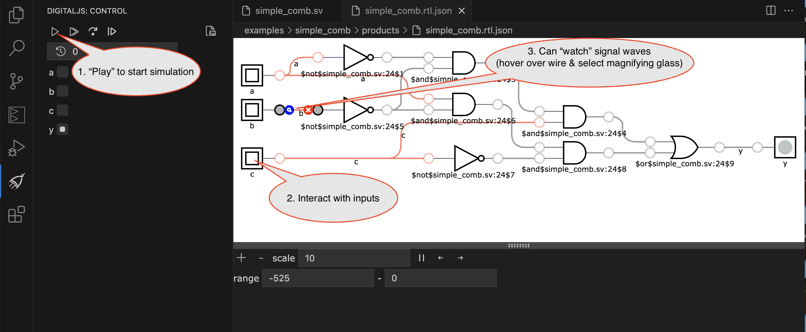

# Launching

1. Fork this repo
1. Open a Codespace on the repository
   

# Usage

## Activities

The activity bar is used for most project navigation and project activities:

## Verilog Example: simple_comb

The `simple_comb` example is an example of a simple combinational logic assignment.  The `testbench verification` task will run a testbench, which will initially fail.  Both syntax errors and testbench failures are shown in the `Problems` tab, like:

If there are **not** syntatic errors, the test bench will display a resulting waveform.  Details can be examined by selecting the module(s) of interest and then variables within the module:

The `Simulate simple_comb.sv` task can be used to show a gate-level simulation. The simulation is not running by default and the play button must be used to start it.

## RISC-V Example: hello

hello.s in hello-risc-v gives an example RISC-V program.

# When done working

## Pausing: Closing Codespace

Close the Codespace whenever pausing work to preserve cloud time.

## Preserving: Committing Back to Repo

Push work back to GitHub to preserve it (and submit assignments).

Be sure to enter a commit message!

# Creating custom project

1. Use the File explorer to create a new directory.
2. Create a `dependencies.mk` file (coping an existing example maybe easiest) and edit it to describe known targets and dependencies.
3. Rebuild Tasks via the `Rebuild Tasks` list. Then select the refresh button at the top of the Tasks view.

# Known problems and Limitations

* Hardware programming depends on Chromium-based browser (Chrome or Edge) for WebUSB
* Some features depend on WebAssembly (Surfer, the waveform viewer and programming hardware)
* Surfer (waveform viewer) depends on graphics card support.  Has issues with some Windows hardware/installations
* DigitalJS simulations are not adapted for colorblindness

# Acknowledgements

* Too many OSS projects/contributers to name!
* [Steven Bell](https://nemo.asee.org/public/conferences/327/papers/39742/view)'s work
* [Hendrik' Folmer](https://github.com/EDAcation)'s work on EDAcation
* [Igor Freire](https://igorfreire.com.br/2023/06/18/vscode-setup-for-systemverilog-development/)'s work on VSCode for SystemVerilog
* All [YoSys HQ](https://yosyshq.net/) maintainers & contributers

# Future Work

* Better test benches / better unit testing
* In-circuit Logic Analyzer

# Misc Examples from fall 2024 course

* [Studio](https://wustl-cse260m-fl24.github.io/studios/studio07a)
* [Wiring](https://wustl-cse260m-fl24.github.io/studios/7/SwitchesRGB_bb.png)
* [Studio / Wiring](https://wustl-cse260m-fl24.github.io/studios/studio07b)

